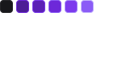

<h1 align="center">
    
</h1>

NLW it's an exclusive and free event, promoted by RocketSeat to teach WEB technologys.
 

  <a href="#rocket-tecnologias">Technologies</a>&nbsp;&nbsp;&nbsp;|&nbsp;&nbsp;&nbsp;
  <a href="#-projeto">Project</a>&nbsp;&nbsp;&nbsp;|&nbsp;&nbsp;&nbsp;
  <a href="#-layout">Layout</a>&nbsp;&nbsp;&nbsp;|&nbsp;&nbsp;&nbsp;
  <a href="#memo-licença">License</a>

 

  

 

  

## 🚀 Technologies

This project was developed using the following technologies:

- HTML e CSS
- JavaScript
- Git e GitHub
- Figma

## 💻 Project

Habits tracker it's an app to help people to track the habits.

- [Visit the online project](https://johnwilker.github.io/nlwSetup)

## 🔖 Layout

You can view the project layout trought [this link](<https://www.figma.com/file/KrGTppw9xhoaO5TgCAXR1v/Habits-(e)-(Community)?t=6jOC28bFGvcsaoW8-1>). Remembering that you need to have a [Figma](http://figma.com/) acount to access it.

## :memo: Licença

This project is under the MIT license. See the file [LICENSE](LICENSE.md) to more details.

---

Made with ♥ by John :wave: [Join the Rocketseat community!](https://discordapp.com/invite/gCRAFhc)